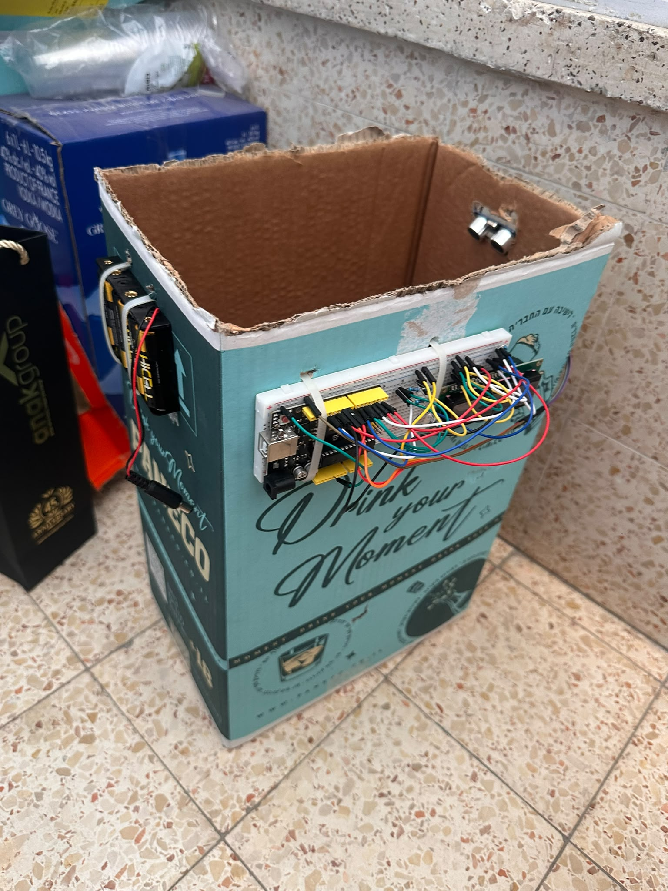

# Smart Trash Can

An Arduino Uno prototype that measures the fill level of a trash bin in real time and displays the percentage and status through an LCD screen and an RGB LED indicator.

## Components

- **Arduino Uno** – main controller running the logic
- **HC-SR04 ultrasonic sensor** – measures the distance between the sensor and the trash inside the bin
- **1602 LCD screen** – displays the fill percentage
- **RGB LED** – shows a color-coded fill status
- Breadboard, resistors, and jumper wires

## How It Works

The system periodically measures the distance from the sensor to the trash, converts it into a fill percentage, and updates the LCD and RGB LED accordingly.

The RGB LED indicates the fill level:

| Fill level | LED color | Meaning |
|---|---|---|
| Below 50% | Green | Bin has room |
| 50%–85% | Blue | Bin is filling up |
| Above 85% | Red | Bin needs to be emptied |

## Wiring

| Component | Arduino Pin |
|---|---|
| HC-SR04 TRIG | 9 |
| HC-SR04 ECHO | 10 |
| RGB LED Red | 13 |
| RGB LED Green | 5 |
| RGB LED Blue | 6 |
| LCD | 12, 11, 7, 4, 3, 2 |

## Calibration

`BIN_DEPTH` is set to 40 cm, measured manually with a ruler from the sensor to the bottom of the bin. If you use a different bin, update this value to match your setup.

## How to Run

1. Install the [Arduino IDE](https://www.arduino.cc/en/software).
2. Connect the components as described in the wiring table above.
3. Open `smart_trash_can.ino` in the Arduino IDE.
4. Select **Tools > Board > Arduino Uno** and the correct **Port**.
5. Click **Upload**.
6. Open the **Serial Monitor** (9600 baud) to see live distance and fill readings.

## Future Improvements

- Add a buzzer alert when the bin passes 85% full
- Connect the system to an IoT platform for remote monitoring across multiple bins (smart city integration)

## Files

- `smart_trash_can.ino` – main Arduino sketch
